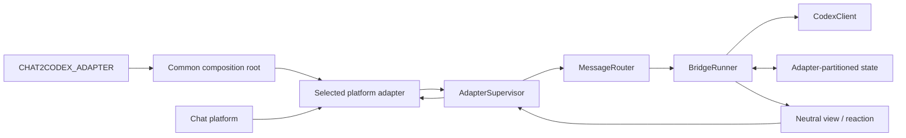

# Architecture

Chat2Codex separates platform transport from execution. Feishu/Lark and native
Weixin ClawBot are production adapters. `src/runtime/platform.ts` selects one,
while `src/runtime/bridge-runtime.ts` is the common composition root for
`CodexRunner`, `MessageRouter`, state, `AdapterSupervisor`, and `ChatSender`.
Adding an adapter implements the contract under `src/adapters`; it does not
construct or change Router/Runner business logic.

The boundaries are intentionally small:

| Layer | Owns | Must not own |
| --- | --- | --- |
| Composition root | Runner, Router, state, Supervisor, neutral ChatSender wiring | platform protocol parsing or rendering |
| Adapter | SDK/HTTP calls, wire events, platform IDs, card/text rendering | Codex queues, recovery, business commands, core construction |
| AdapterSupervisor | lifecycle, health, strict `adapterId` routing | platform payload parsing, Codex behavior |
| MessageRouter | normalized ingress dispatch | SDK construction, execution state |
| BridgeRunner | access control, durable work, approvals, Codex lifecycle | platform SDKs and wire payloads |
| State store | schema-v2 envelope and isolated adapter partitions | adapter-specific objects |

## Adapter contract

A `ChatAdapter` supplies a stable descriptor, capability flags, lifecycle,
view send/update operations, message reactions, and attachment streams. It
emits only normalized message, action, and diagnostic events. Interactive
decisions are validated by an injected `InteractionPolicy` against the exact
view disclosed by that adapter.

For ordinary runs, the core requests a processing reaction on the source
message, emits throttled text progress, and removes the reaction at terminal
state. Interactive-capable adapters use views; text-only adapters use
sender-bound reply codes for approval and structured decisions. The adapter
alone maps neutral operations to platform calls.

| Capability | Feishu/Lark | Weixin v1 |
| --- | --- | --- |
| Markdown / rich post | yes | no, rendered as text |
| Interactive/updateable views | yes | no |
| Inbound attachments | image, file | image, file via encrypted CDN |
| Processing signal | message reaction | typing indicator |
| Conversation scope | direct and allowlisted groups | direct only |

The Weixin adapter uses `weixin:<ilink_bot_id>` as its stable adapter id. It
commits `getupdates` cursors only after the complete batch reaches the core, so
a failed batch replays through the core message-id deduplicator. Its private
runtime file retains the cursor, latest per-user `context_token`, typing ticket,
and short-lived attachment descriptors. Outbox idempotency keys become iLink
`client_id` values. Groups, voice/video, outbound media, and in-place updates
are intentionally outside the v1 boundary.

Run `bun run typecheck:contracts` to compile the reference adapter and
`bun test tests/architecture-boundaries.test.ts` to verify the isolation rule.

Adapters currently run in the Chat2Codex process. A future external gateway
can move platform credentials and SDKs into another process without changing
the core contracts. Process-level isolation is not part of the current architecture.
