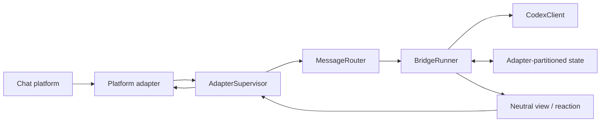

# Architecture

Chat2Codex separates platform transport from execution. Feishu/Lark is the
only production adapter shipped in this release, but adding another adapter
implements the contract under `src/adapters` and registers it at composition;
it does not change Router or Runner business logic.

The boundaries are intentionally small:

| Layer | Owns | Must not own |
| --- | --- | --- |
| Adapter | SDK calls, wire events, platform IDs, card/post rendering | Codex queues, recovery, business commands |
| AdapterSupervisor | lifecycle, health, strict `adapterId` routing | platform payload parsing, Codex behavior |
| MessageRouter | normalized ingress dispatch | SDK construction, execution state |
| BridgeRunner | access control, durable work, approvals, Codex lifecycle | platform SDKs and wire payloads |
| State store | schema-v2 envelope and isolated adapter partitions | adapter-specific objects |

## Adapter contract

A `ChatAdapter` supplies a stable descriptor, capability flags, lifecycle,
view send/update operations, message reactions, and attachment streams. It
emits only normalized message, action, and diagnostic events. Interactive
decisions are validated by an injected `InteractionPolicy` against the exact
view disclosed by that adapter.

For ordinary runs, the core requests a processing reaction on the source
message, emits throttled text progress, and removes the reaction at terminal
state. Approvals and structured input continue to use interactive views. The
adapter alone maps those neutral operations to platform SDK calls.

Run `bun run typecheck:contracts` to compile the reference adapter and
`bun test tests/architecture-boundaries.test.ts` to verify the isolation rule.

Adapters currently run in the Chat2Codex process. A future external gateway
can move platform credentials and SDKs into another process without changing
the core contracts. Process-level isolation is not part of the current architecture.
